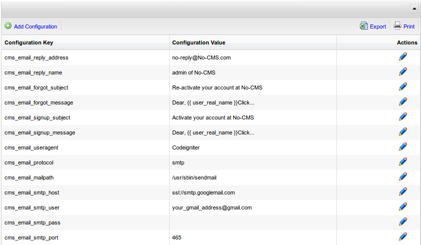

[Up](../tutorial.md)

Configuration
=============
There are a lot of “hidden” configuration to be managed here. If you are familiar with windows OS, configuration management is similar to regedit. It is a place when you can manage various configuration. Normally you don't need to do anything with configuration management, but when you want to mess up with it, please make sure you know what you do. Some configuration keys are vital.

Delete it or give a wrong value will make your entire website doesn't work. With configuration management you can manage several things, including automatic e mail sending, google analyticaccount, etc.

You can access Configuration management by clicking `CMS Management | Configuration Management`. Just make sure to be very careful.

Also, if you want to activate "forgot-password" and "sign-up" activation, you need to modify several configuration value. More about it, please click on [FAQ](../faq/technical.md#email-sending)
