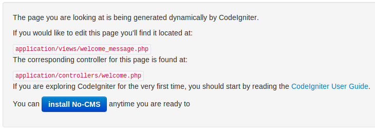

[Up](../tutorial.md)

Installation
============

* Download No-CMS from [No-CMS repository](https://github.com/goFrendiAsgard/No-CMS) on GitHub

* Copy and extract it on your web server directory (If you use windows, you might want to try it locally via xampp, in this case, your server directory is `c:\xampp\htdocs`. If you use linux, the web server directory is usually `/var/www`)

* Access the url (If you use xampp in your local computer, the url should be http://localhost/No-CMS)

* Click "Install No-CMS"
  

* Fill database information. You can change it later by editing `/application/config/main/databse.php`
  

* Click "Next", and fill CMS Setting information, especially administrator information. If your server has `mod_rewrite` installed, it is recommended to `hide index.php`. You can also check `gzip compression`, so that No-CMS will compress every response to client. This wil reduce the network-traffic, but sometime can also cause several errors. You can change CMS Setting information later by editing `/application/config/main/config.php`
  

* You can also optionally add several third party authentication by clicking the corresponding tabs. You can change it later by accessing `CMS Management | Setting`

* If there is no error, click `Install now` button. Wait for several seconds until the installation finished, the installer will do everything for you (including creating database, make config files, and install default modules)

__PS:__ Git user can do this instead of typical download-and-extract:
```
    git clone https://github.com/goFrendiAsgard/No-CMS.git
```
