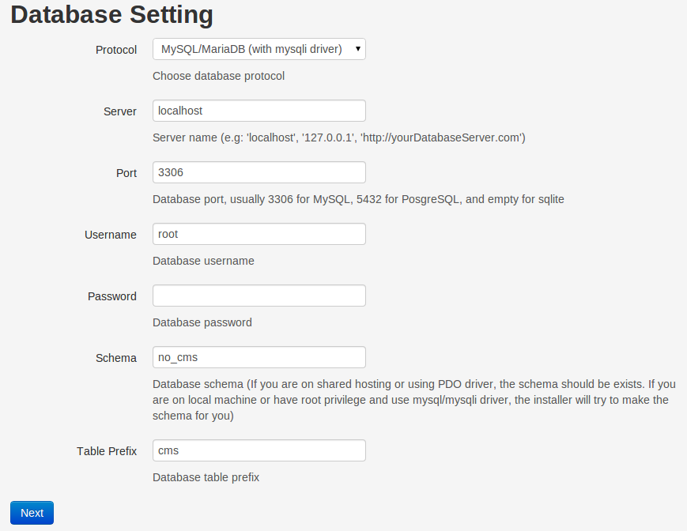
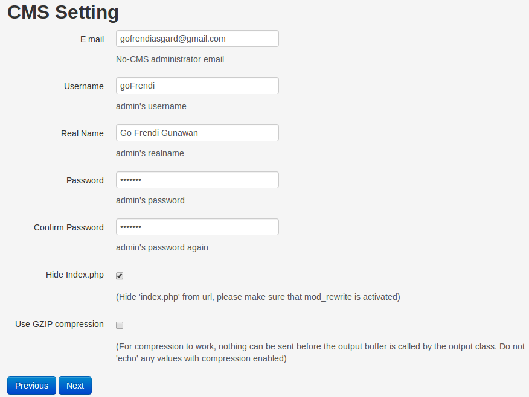

[Up](../tutorial.md)

Installation
============

* Download No-CMS from [No-CMS repository](https://github.com/goFrendiAsgard/No-CMS) on GitHub

* Copy and extract it on your web server directory (If you use windows, you might want to try it locally via xampp, in this case, your server directory is `c:\xampp\htdocs`. If you use linux, the web server directory is usually `/var/www`)

* Access the url (If you use xampp in your local computer, the url should be http://localhost/No-CMS)

* Click "Install No-CMS"
  

* Fill database information. You can change it later by editing `/application/config/databse.php`
  

* Click "Next", and fill CMS Setting information, especially administrator information. If your server has `mod_rewrite` installed, it is recommended to `hide index.php`. If you are sure about things, you can check `gzip compression` to make the framework compress every response to client, this wil reduce the traffic, but sometime will also cause several errors. You can change CMS Setting information later by editing `/application/config/config.php`
  

* You can also optionally add several third party authentication by clicking the corresponding tabs. You can change it later by editing `application/config/hybridauthlib.php`

* If there is no error, click `Install now` button. Wait for several seconds until the installation finished, the installer will do everything for you (including creating database, make config files, and install several default modules)
  

* Once installation finished, you can do several things to enchance performance & security

__PS:__ Git user can do this instead of typical download-and-extract:
```
    git clone git@github.com:goFrendiAsgard/No-CMS.git
```

Performance & Security Enchancement
===================================
* Go to `index.php`, change these code:
    ```php
        if(!file_exists('./application/config/database.php')){
            define('ENVIRONMENT', 'first-time');
        }else{
            define('ENVIRONMENT', isset($_SERVER['CI_ENV']) ? $_SERVER['CI_ENV'] : 'development');
        }
    ```
    into:
    ```php
        define('ENVIRONMENT', isset($_SERVER['CI_ENV']) ? $_SERVER['CI_ENV'] : 'production');
    ```
    This will save extra step, so that the program doesn't need to check existance of `/application/config/database.php`

    __PS__: When you update No-CMS this changes will be overriden.

* If you are using linux, please do this:
    ```
        chown your_user .htaccess
        chmod ./reset-installation.sh 600
        chown -R your_user ./application/config
        chmod ./application/config 744 -R
    ```
    This will make your site more secure (does not mean invulnerable)