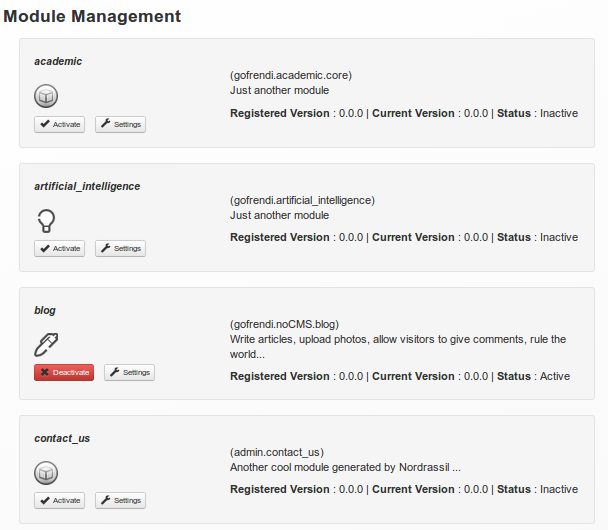

[Up](../tutorial.md)

Modules
=======
You can activate, deactivate, configure and upload new modules by accessing `CMS Management | Module Management`.

No-CMS come with several default modules that can be activated or deactivated as you need
