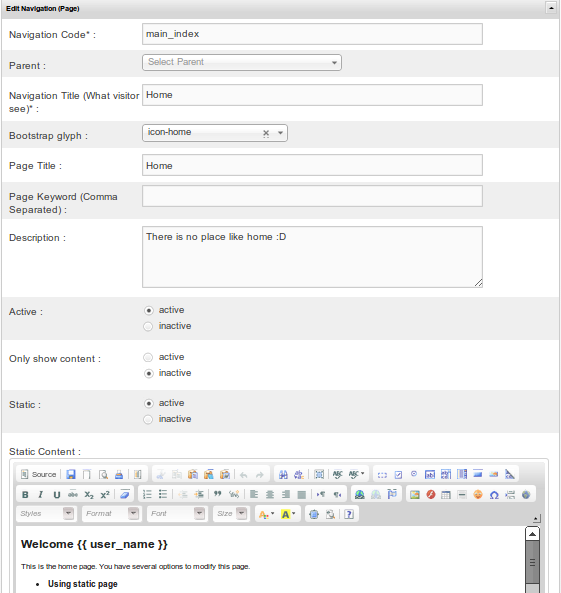
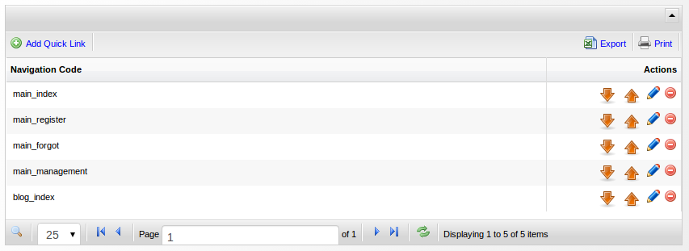

[Up](../tutorial.md)

Navigation (Pages)
==================

A website is actually collection of web-pages. Making a page is a very crucial feature in every common-used CMS.
Usually, a website has a navigation so that a user can jump among pages.

To create, add, edit, and delete navigation or pages you can use `CMS Management | Navigation Management`

Page has several common properties including:

* __Navigation Code__ (required, and should be unique)

    This is the identifier of a page/navigation.

* __Navigation Title__
    This will be appeared in Navigation Menu

* __Page Title__

    The title of the page. It will be appeared in your browser's tab. This is also useful for SEO, so it is recommended to give an appropriate title to make your website search-engine friendly.

* __Page Keyword__

    Some old web-crawler still use meta tag. This is not very useful now a day, since several search engine use title and page content to do crawl activities.

* __Authorization__

    One of No-CMS best feature is page authorization. You have full control of what page can be accessed by certain user group. This can be easily done by changing “authorization” value of a page in Navigation management. Four authorization type is provided for this purpose: Everyone, authenticated, unauthenticated and authorized (See Authorization in [basic concepts section](user_concepts.md#authorization)). If you choose authorized, you should also provide user-group.

* __Default Theme__

    Every page can has custom theme different to theme choosen on [change theme menu](user_theme.md). To do this, you can choose an appropriate “Default Theme”. This will overwrite No-CMS default theme setting. Normally you can access a page by using navigation menu. It is natural to have some grouped pages. You can change “Navigation Parent Code” to make a page nested in another page.

* __Static__

    If activated, your page will be `static`, otherwise it will be `dynamic`.
    Here is the difference between those two:

    - Static page

        Static pages are only contains of HTML and CSS without any need of server-side programming. This is the easiest one to create. You can create new static page without even know any programming knowledge. If you are already familiar with MS word, Libre-Office write or any word-processor program, then you already have everything to make static page. To make a new static page, you need to change the activate “static” option. Once you activate static option, a word-editor-like input will be appeared. Do your editing there.

    - Dynamic page

        Dynamic pages are more than just static page. There are some server-side programming involved. A normal user might don't need to mess up with this. Navigation Management, user management and group management are some example of dynamic page. When you deactivate static option, you will be asked for the URL.

Quicklinks
==========

As your application grow, some frequently accessed page might be burried down in the navigation hierarchy.
No-CMS has `quicklink` to solve such a problem. To create and delete quicklink, you can access `CMS Management | Quicklink Management`

Tutorial
========

Below is a bit tutorial about how to make your own page, sub-page & quicklink:

* Login to No-CMS with your admin user.
* Open `Complete Menu | CMS Management | Navigation Management` or `CMS Management | Navigation Management`, you will be able to see several navigation menu. Every navigation (page) can has several `children-page`.  
* Add a new page by clicking `Add Navigation (Page)`
* Set `Navigation Code` into `new_page`
* Set `Navigation Title` into `My Page`
* Set `Page Title` into `My First Page`
* Set `Static` into `active`
* Set `Static Content` into `Hello World !!!`
* Set `Authorization` into `Everyone`
* Click `Save and Go Back to List`

You can access your new page by clicking `Complete Menu | My Page`.
This new page can be accessed by `Everyone`. 

No-CMS has several authorization type:
* __Everyone__: Can be accessed by all visitor.
* __Unauthenticated__: Can only be accessed by not currently login visitor.
* __Authenticated__: Can only be accessed by already login visitor
* __Authorized__: Can only be accessed by already login visitor who is also member of certain `group`

Let's add another page as sub-page:

* Open `Complete Menu | CMS Management | Navigation Management` or `CMS Management | Navigation Management`
* Add a new page by clicking `Add Navigation (Page)`
* Set `Navigation Code` into `new_subpage`
* Set `Parent` into `new_page` (Navigation Code of our previous page)
* Set `Navigation Title` into `My Subpage`
* Set `Page Title` into `My Second Page`
* Set `Static` into `active`
* Set `Static Content` into `Great, you made it !!!`
* Set `Authorization` into `Everyone`
* Click `Save and Go Back to List`

You can access this page by clicking `Complete Menu | My Page | My Subpage`

__PS:__ So far you have learn how to make static page. However, there is another page type called `dynamic page`. To make a dynamic page, you must set `static` into `inactive` and fill the url with coresponding url (`module_name/controller_name/function_name`). If you are not familiar with CodeIgniter and HMVC extension, please look for [CodeIgniter documentation](../../ci_user_guide) or [HMVC extension documentation](https://bitbucket.org/wiredesignz/codeigniter-modular-extensions-hmvc) first.

Now let's make a quick link:

* Open `Complete Menu | CMS Management | Quick Link Management` or `CMS Management | Quick Link Management`  
* Add new quick link by clicking `Add Quick Link`
* Set `Navigation Code` into `new_subpage`
* Click `Save and Go Back to List`

__PS:__ Avoid temptation to make too many quicklink

Now, you can access `new_subpage` directly.