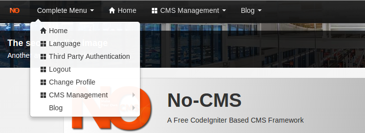
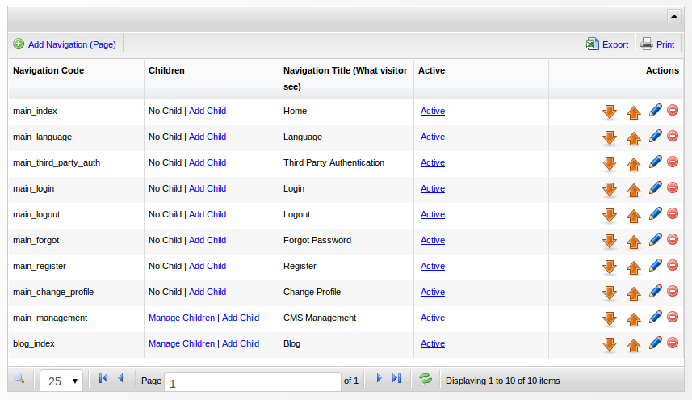

[Up](../tutorial.md)

Navigation (Pages) & Quicklinks
==============================

A website is actually collection of web-pages. Making a page is a very crucial feature in every common-used CMS.
Usually, a website has a navigation so that a user can jump among pages.

No-CMS allow you to make your own page:

* Login to No-CMS with your admin user.
* Open `Complete Menu | CMS Management | Navigation Management` or `CMS Management | Navigation Management`, you will be able to see several navigation menu. Every navigation (page) can has several `children-page`.
  
* Add a new page by clicking `Add Navigation (Page)`
* Set `Navigation Code` into `new_page`
* Set `Navigation Title` into `My Page`
* Set `Page Title` into `My First Page`
* Set `Static` into `active`
* Set `Static Content` into `Hello World !!!`
* Set `Authorization` into `Everyone`
* Click `Save and Go Back to List`

You can access your new page by clicking `Complete Menu | My Page`.
This new page can be accessed by `Everyone`. 

No-CMS has several authorization type:
* __Everyone__: Can be accessed by all visitor.
* __Unauthenticated__: Can only be accessed by not currently login visitor.
* __Authenticated__: Can only be accessed by already login visitor
* __Authorized__: Can only be accessed by already login visitor who is also member of certain `group`

Let's add another page as sub-page:

* Open `Complete Menu | CMS Management | Navigation Management` or `CMS Management | Navigation Management`
* Add a new page by clicking `Add Navigation (Page)`
* Set `Navigation Code` into `new_subpage`
* Set `Parent` into `new_page` (Navigation Code of our previous page)
* Set `Navigation Title` into `My Subpage`
* Set `Page Title` into `My Second Page`
* Set `Static` into `active`
* Set `Static Content` into `Great, you made it !!!`
* Set `Authorization` into `Everyone`
* Click `Save and Go Back to List`

You can access this page by clicking `Complete Menu | My Page | My Subpage`

As your application grow, some frequently accessed page might be burried down in the navigation hierarchy.
No-CMS has `quick link` to solve such a problem.

Now let's make a quick link:

* Open `Complete Menu | CMS Management | Quick Link Management` or `CMS Management | Quick Link Management`
  
* Add new quick link by clicking `Add Quick Link`
* Set `Navigation Code` into `new_subpage`
* Click `Save and Go Back to List`

__PS:__ Avoid temptation to make too many quicklink

Now, you can access `new_subpage` directly.