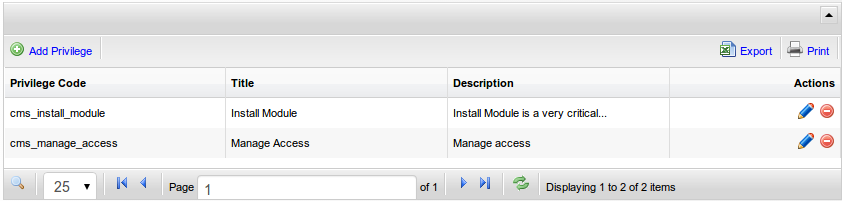

[Up](../tutorial.md)

Privilege
=============

Privilege is used if you want something more than just show or hide a page.
Using privilege require some programming expertise. No-CMS come with 2 default privilege. Please ensure to only give those privileges only to those you trust to manage your website. Idealy, only `Super Admin` should has those privileges.

