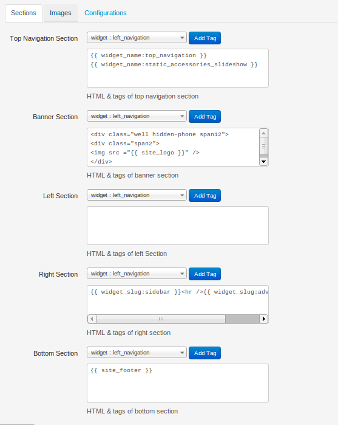
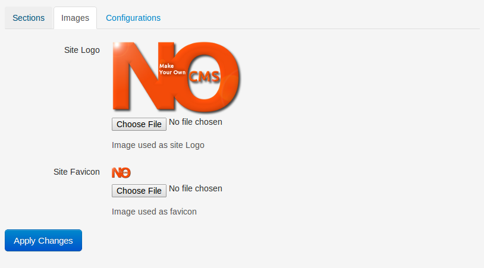
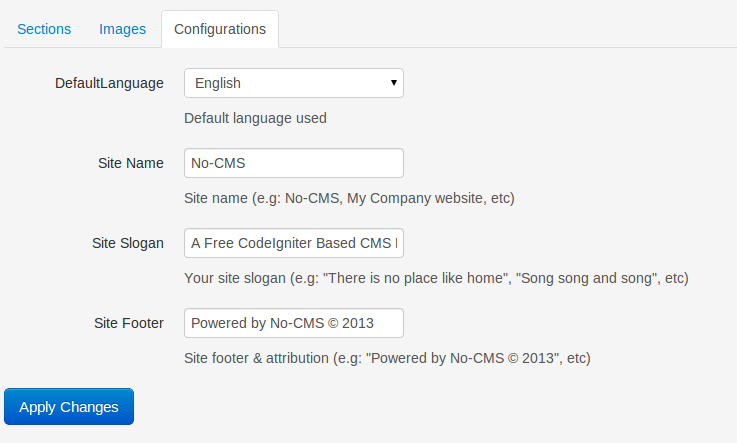

[Up](../tutorial.md)

Layout Management
=================
You can access layout management by clicking `CMS Management | Layout Management`
There are three tabs available in layout management:

* __Section__

  Here you can put widget/text to be appeared in each section of your page. Basically every page has 4 section (__Note:__ Minimal theme only use Navigation Section):

  - Top Navigation Section (This is where your navigation & slideshow appeared)
  - Banner Section (This is where your banner, including site title and slogan appeared)
  - Left Section (usually it is empty, but you can add `{{ widget_left_nav }}` if you like)
  - Right Section (usually your sidebar widgets will be shown here, but you have a freedom to show/not show things)
  - Bottom Section (This is most bottom part of your page, you might want to write some copyright information here)

  

* __Image__

  Here you can change Site logo and favicon. Alternatively, you can also use [Configuration Management](user_configuration.md) to change site logo and favicon setting.
  

* __Configuration__

  Here you can change several layout-related configuration value, such as: Site title, Site slogan, and site footer. Alternatively, you can also use [Configuration Management](user_configuration.md) to change site title, slogan and footer.
  