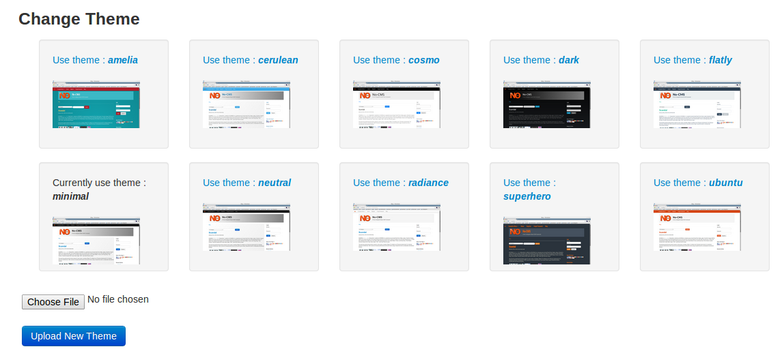

[Up](../tutorial.md)

Themes
======

Themes is a visual matter. Different theme will make your site looks different. You can change and upload new theme by accessing `CMS Management | Change Theme`.

Beside themes, there is also a [layout management](user_layout.md) that let you configure several parts of your themes.

If you are a designer, and you want to make your own custom theme, please read [designer's theme guide](designer_themes.md)