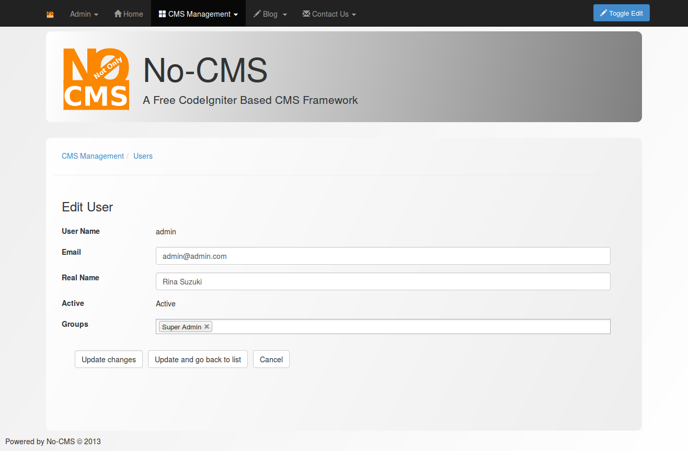

[Up](../tutorial.md)

Users and groups 
================

User
----

Users are registered visitor. To be a user of No-CMS, one need to register. The registration can be done via registration page or by using third-party authentication (if activated). You can manage users by accessing `CMS Management | User Management.`

Group
-----

A user can be a member of several user group, and a user group can contains many user. Group represent user's role. Since a user can has several role, therefore he/she can also be member of several group. User group is important for page with `authorized` authorization type. You can manage group by accessing `CMS Management | Group Management`.

A group can also asociated with [navigation](user_navigation.md) and [privilege](user_privilege.md)

You can manage `user` and `user-group` relation by using both, group management or user management.

__PS :__ if a user is a member of Super Admin user-group, he/she will always be authorized to view any page and has any privilege. Be sure whenever you want to assign a user into `Super Admin` user group.
