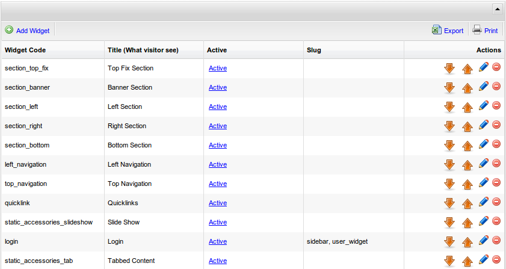

[Up](../tutorial.md)

Widgets
=======

Widget is everything that can be injected into your page. It can be a simple javascript, or even another page. You can manage widget by accessing `CMS Management | Widget Management`.
 

Like pages, you can also define widget's authorization type. A widget can has several slugs (separated by comma). The slugs are used to group and identify widgets.

No-CMS has several built-in widgets.


| Widget name/Code                 | Slugs                | Description                                                                                                                                   |
| :------------------------------- | :------------------- | :-------------------------------------------------------------------------------------------------------------------------------------------- |
| section_top_fix                  | None                 | Top section (used in [Layout Management](user_layout.md)).<br />This widget usually contains another widgets                                  |
| section_banner                   | None                 | Banner (used in [Layout Management](user_layout.md).<br />This widget usually contains another widgets                                        |
| section_left                     | None                 | Left Section (used in [Layout Management](user_layout.md)).<br />This widget usually contains another widgets                                 |
| section_right                    | None                 | Right Section (used in [Layout Management](user_layout.md)).<br />This widget usually contains another widgets                                |
| section_bottom                   | None                 | Bottom Section (used in [Layout Management](user_layout.md).<br />This widget usually contains another widgets                                |
| left_navigation                  | None                 | Left navigation, usually put under Left section                                                                                               |
| top_navigation                   | None                 | Complete top navigation + Quicklink                                                                                                           |
| quicklink                        | None                 | Quicklink without complete menu                                                                                                               |
| login                            | sidebar, user_widget | Login form                                                                                                                                    |
| logout                           | sidebar, user_widget | Logout link                                                                                                                                   |
| static_accessories_slideshow     | None                 | Slideshow (You can manage the slideshow by accessing:`CMS Management | Static Accessories`)                                                   |
| static_accessories_tab           | None                 | Tabbed Content, usually put on main_index navigation (You can manage the tab content by accessing: `CMS Management | Static Accessories`)     |
| static_accessories_visitor_count | None                 | Visitor counter (You can get more detail visitor information by accessing: `CMS Management | Static Accessories`)                             |
| social_plugin                    | sidebar              | Link to share the page to any social media                                                                                                    |
| google_search                    | sidebar              | Google Search                                                                                                                                 |
| google_translate                 | sidebar              | Google Translate                                                                                                                              |
| calendar                         | sidebar              | Calendar                                                                                                                                      |
| google_map                       | sidebar              | Google Map (edit to point to different location)                                                                                              |
| donate_nocms                     | advertisement        | A simple `buy me coffee` button                                                                                                               |
| blog_newest_article              | sidebar              | Newest article from blog module                                                                                                               |
| blog_article_category            | sidebar              | Categories from blog module                                                                                                                   |

Put a widget:

* To put a widget in a desired location for every pages, you can use [Layout Management](user_layout.md).
* To put a widget as a content of your page, you can use [Navigation Management](user_navigation.md) and edit the static content.
* More advance designer/programmer might also like to edit the theme file directly. To do this, please refer to [designer's theme guide](designer_themes.md)

Widget tags:

* You can put a single widget by using `{{ widget_name:your_widget_name }}`. E.g: `{{ widget_name:logout }}` will be parsed into logout link.
* You can also put a group of widgets by using `{{ widget_slug:your_widget_slug }}`. E.g: `{{ widget_slug:user_widget }}` will put both login form and logout link (however only one can appeared at a time, since `login` widget only appeared to `unauthenticated` visitor, while `logout` widget only appeared to `authenticated` user).
* You can even put widget as part of your page by editing your page static content.

Tutorial
========

Let's add new widget

* Open `Complete Menu | CMS Management | Widget Management` or `CMS Management | Widget Management`. There is already several built-in widgets
* Add new widget by clicking `Add Widget`
* Set `Widget Code` into `my_widget`
* Set `Static` into `active`
* Set `Static Content` into

    ```html
        <strong>Hello there</strong> 
        <p>you can put html tags, and even a black cat here:</p>
        <embed src="http://s3.amazonaws.com/wbx-files/maukie.swf" width="330" height="400" type="application/x-shockwave-flash" id="widgetbox_widget_flash_0" name="widgetbox_widget_flash_0" allowscriptaccess="sameDomain" bgcolor="FFFFFF" wmode="transparent" pluginspage="http://www.macromedia.com/go/getflashplayer">
    ```
* Set Slug into `sidebar`
* Click `Save and Go Back to List`

Now look at the right side of your site. There should be a black cat appeared (if you have flash player).